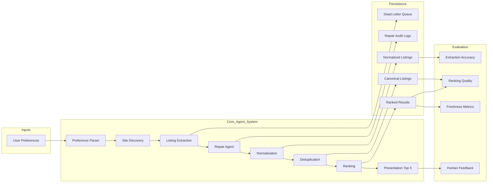

# Student Housing Agentic System — Discovery-First Starter

This project now uses a **discovery → verify → probe → scrape** flow before attempting a full scrape.

## System Flow



## New discovery-first structure

```mermaid
flowchart LR
    A[User Preferences] --> B[LLM Web Discovery]
    B --> C[URL Verification]
    C --> D[Site Ranking]
    D --> E[Probe One Listing]
    E --> F[Approved Sites]
    F --> G[Full Extraction]
    G --> H[Repair]
    H --> I[Normalization]
    I --> J[Deduplication]
    J --> K[Ranking Top 5]
```



## Rationale

It prevents the scraper from jumping straight into blocked or malformed sites.
Each site now has to:

1. be discovered
2. have a valid URL
3. pass a probe
4. return one minimally valid listing row

Only after that does the system use the site for full extraction.

## Main commands

```bash
python -m pipelines.run_discovery
python -m pipelines.run_search
python -m pipelines.run_eval
```

## Main outputs

- `site_candidates.json`
- `verified_sites.json`
- `probe_results.jsonl`
- `approved_sites.json`
- `raw_listings.jsonl`
- `normalized_listings.jsonl`
- `canonical_listings.jsonl`
- `ranked_results.json`

## Notes

- Default discovery backend is `sample` so the project runs without an API key.
- OpenAI web search is wired as a placeholder in `llm_clients/openai_discovery_client.py`.
- Full scraping should only target sites from `approved_sites.json`.
