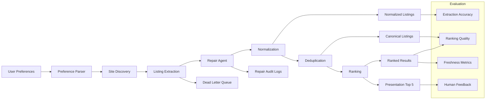

# Student Housing Agentic System

A modular, repair-first agentic system for finding student housing near universities.

## What this repo includes

- Typed schemas for preferences, listings, eval cases, and repairs
- A staged pipeline:
  1. Preference parsing
  2. Site discovery
  3. Listing extraction
  4. Repair triage
  5. Normalization
  6. Deduplication
  7. Ranking
  8. Presentation
- JSON/JSONL outputs for every major stage
- A dead-letter queue for failed rows
- A sample adapter and sample data so the pipeline runs end-to-end

## Quick start

```bash
python -m pipelines.run_search
python -m pipelines.run_eval
```

## GitHub branch workflow

```bash
git checkout -b feature/full-implementation
# copy these files into your repo
git add .
git commit -m "Add full housing agent implementation scaffold"
git push -u origin feature/full-implementation
```

## Architecture


