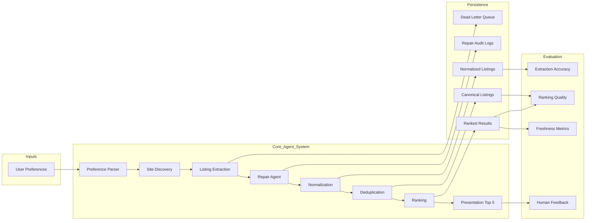

# Student Housing Agentic System

A modular, repair-first agentic system for finding student housing near universities.

## System Flow



## What this package adds

This snapshot keeps the working deterministic pipeline and adds a real browser-backed scraper starter:

- `.env.example` and runtime settings
- Playwright-based browser manager
- HTML snapshot/debug fetch script
- Browser-backed site adapter scaffold
- Index-page and detail-page parser helpers
- Placeholder OpenAI repair client hook
- A config switch so you can keep using the sample adapter until a real site is ready

## Repo structure

```text
config/
  settings.py
scrapers/
  browser.py
  fetch_page.py
  snapshot.py
extractors/
  selectors.py
  listing_index_extractor.py
  listing_detail_extractor.py
parsers/
  parse_listing_index.py
  parse_listing_detail.py
adapters/
  sample_adapter.py
  playwright_site_adapter.py
pipelines/
  run_search.py
  run_eval.py
  run_fetch_debug.py
```

## Quick start

### 1. Create a virtual environment

```bash
python3 -m venv .venv
source .venv/bin/activate
```

### 2. Install dependencies

```bash
pip install -r requirements.txt
playwright install
```

### 3. Copy env template

```bash
cp .env.example .env
```

### 4. Run the existing sample pipeline

This keeps the project fully runnable before you wire a real housing site.

```bash
python -m pipelines.run_search
python -m pipelines.run_eval
```

### 5. Test the new browser fetch layer

```bash
python -m pipelines.run_fetch_debug --url https://example.com --output-dir data/debug/example_fetch
```

This will save `page.html` and `meta.txt` so you can inspect real rendered HTML.

## Switching from sample mode to browser-backed scraping

By default, `.env.example` uses:

```bash
SCRAPER_BACKEND=sample
```

When you are ready to test a real site:

1. change `.env` to:

```bash
SCRAPER_BACKEND=playwright
```

2. copy the example site config:

```bash
cp data/site_configs/playwright_sites.example.json data/site_configs/playwright_sites.json
```

3. edit `data/site_configs/playwright_sites.json` with the real site values:
   - `base_url`
   - `search_url_template`
   - selector assumptions in `extractors/selectors.py` if needed

4. rerun:

```bash
python -m pipelines.run_search
```

## Where to put your OpenAI API key

Add it to `.env` like this:

```bash
OPENAI_API_KEY=your_real_key_here
```

The placeholder hook lives in:

```text
llm_clients/openai_repair_client.py
```

Use it later for narrow repair calls only, not full-page extraction.

## Recommended first implementation order

1. Confirm `run_fetch_debug` works on a target site.
2. Tune `extractors/selectors.py` for that site.
3. Get `PlaywrightSiteAdapter` to return 3–5 raw rows.
4. Feed those rows into `run_search`.
5. Only then wire the OpenAI repair client.

## GitHub branch flow

```bash
git checkout -b feature/web-scraper-starter
# copy these files into your repo
git add .
git commit -m "Add browser-backed scraper starter"
git push -u origin feature/web-scraper-starter
```
